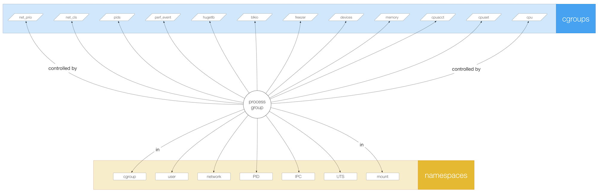

# cinf

This is `cinf`, short for container info, a command line tool to view namespaces and cgroups, the stuff that makes up Linux containers such as Docker, rkt/appc, or OCI/runc. It might be useful for low-level container prodding, when you need to understand what's going on under the hood. Read more here: [Containers are a lie](https://medium.com/@mhausenblas/containers-are-a-lie-2521afda1f81) …

Contents:

- [Install](#install) `cinf`
- [Use](#use) `cinf` to
  - [see all namespaces](#to-see-all-namespaces)
  - dig into a [namespace](#to-dig-into-a-namespace)
  - dig into a [cgroup](#to-dig-into-a-cgroup)
  - dig into a [process](#to-dig-into-a-process) 
  - [monitor a process](#to-monitor-a-process)
- [CLI reference](#cli-reference)
- [Background](#background) on namespaces and cgroups

## Install

Simply download the Linux binary:

    $ curl -s -L https://github.com/mhausenblas/cinf/releases/download/v0.4.0-alpha/cinf -o cinf
    $ sudo mv cinf /usr/local/bin
    $ sudo chmod +x /usr/local/bin/cinf

Or build from source (note that you'll get the latest, experimental version via this method):

    $ go get github.com/olekukonko/tablewriter
    $ go get github.com/mhausenblas/cinf
    $ go get github.com/buger/goterm
    $ GOOS=linux go build
    $ godoc -http=":6060"

Note that the package docs are also available [online](https://godoc.org/github.com/mhausenblas/cinf/namespaces).

## Use

The following sections show basic usage. For a complete end-to-end usage, see the [walkthrough](walkthrough.md).

Note that if you want to see detailed debug messages, you can do that via a `DEBUG` environment variable, like so: `sudo DEBUG=true cinf`.

### To see all namespaces

To list all available namespaces and a summary of how many processes are in them along with the user IDs and the top-level command line executed, simply do the following:

    $ sudo cinf
    
    NAMESPACE   TYPE  NPROCS  USERS                     CMD
    
    4026532396  pid   1       1000                      sleep10000
    4026532398  net   1       1000                      sleep10000
    4026531837  user  109     0,1,101,102,104,106,1000  /sbin/init
    4026532196  pid   2       0,104                     nginx: master proces
    4026532293  mnt   1       0                         md5sum/dev/urandom
    4026532298  net   1       0                         md5sum/dev/urandom
    4026532393  mnt   1       1000                      sleep10000
    4026532296  pid   1       0                         md5sum/dev/urandom
    4026531840  mnt   104     0,1,101,102,106,1000      /sbin/init
    4026531839  ipc   105     0,1,101,102,106,1000      /sbin/init
    4026531836  pid   105     0,1,101,102,106,1000      /sbin/init
    4026532193  mnt   2       0,104                     nginx: master proces
    4026532198  net   2       0,104                     nginx: master proces
    4026531838  uts   105     0,1,101,102,106,1000      /sbin/init
    4026532194  uts   2       0,104                     nginx: master proces
    4026532294  uts   1       0                         md5sum/dev/urandom
    4026532394  uts   1       1000                      sleep10000
    4026532395  ipc   1       1000                      sleep10000
    4026531956  net   105     0,1,101,102,106,1000      /sbin/init
    4026531856  mnt   1       0
    4026532195  ipc   2       0,104                     nginx: master proces
    4026532295  ipc   1       0                         md5sum/dev/urandom

### To dig into a namespace

Assuming we're interested in more information on namespace `4026532398`, we would do the following:

    $ sudo cinf --namespace 4026532193

### To dig into a cgroup

Let's dig into a specific cgroup (with hierarchy ID `3`) of a process (with PID `27681`):

    $ sudo cinf --cgroup 27681:3

### To dig into a process

It is also possible to list the namespaces a specific process is in:

    $ sudo cinf --pid 27681

### To monitor a process

The interactive, `top` like mode of `cinf` is as follows. Let's say we want to monitor the control files `memory.usage_in_bytes`, `cpuacct.usage`, and `blkio.throttle.io_service_bytes` for process with PID `27681`: 

    $ sudo cinf --mon 27681:memory.usage_in_bytes,cpuacct.usage,blkio.throttle.io_service_bytes

Note that a more detailed usage description is available via the [walkthrough](walkthrough.md).

## CLI reference

There are three arguments you can provide to `cinf`, to dig into specific aspects of a namespace, cgroup, or process:

- `--namespace $NAMESPACE_ID` … List details about namespace with provided ID.
- `--cgroup $PID:$CGROUP_HIERARCHY_ID` … List details of a cgroup a process belongs to.
- `--pid $PID` … List namespaces the process with provided process ID is in.
- `--mon $PID:$CF1,$CF2,…` … Monitor process with provided process ID and the control files specified.

The meaning of the output columns is as follows:

- Overview (without arguments):
  - `NAMESPACE` … the namespace ID
  - `TYPE` … the type of namespace, see also [explanation of the namespaces](#overview-on-linux-namespaces-and-cgroups) below
  - `NPROCS` … number of processes in the namespace
  - `USERS` … user IDs in the namespace
  - `CMD` … command line of the root process
- Detailed namespace view (`--namespace`):
  - `PID` … process ID
  - `PPID` … process ID of parent
  - `NAME` … process name
  - `CMD` … process command line
  - `NTHREADS`… number of threads
  - `CGROUPS` … summary of the attached cgroups
  - `STATE` … process state
- Detailed cgroups view (`--cgroup`):
  - `CONTROLFILE` … the name of the control file, see also [cgroup man pages](#reading-material) below
  - `VALUE` … the content of the control file
- Detailed process view (`--pid`):
  - `NAMESPACE` … the namespace ID
  - `TYPE` … the type of namespace
- Monitor process view (`--mon`):
  - `PID` … process ID
  - `PPID` … process ID of parent
  - `UIDS` … real, effective, saved set, filesystem user ID
  - `STATE` … process state
  - `NAMESPACE` … the IDs of the namespaces the process is in  
  - `CONTROLFILE` … the name of the control file, see also [cgroup man pages](#reading-material) below
  - `VALUE` … the content of the control file

## Background

Conceptually the ER diagram for namespaces, cgroups and process (groups) looks as follows:

Read: a process (or more precise a process group) can be in one or more namespaces and can be controlled by one or more cgroups, where the namespaces provide isolation concerning a certain aspect, such as user IDs, networking stack or mount points and the cgroups allowing to control resource consumption as well as provide accounting information in terms of resource usage. 

### Overview on Linux namespaces and cgroups

- Mount/`CLONE_NEWNS` (since Linux 2.4.19) via `mount`, `/proc/$PID/mounts`: filesystem mount points
- UTS/`CLONE_NEWUTS` (since Linux 2.6.19) via `uname -n`, `hostname -f` : nodename/hostname and (NIS) domain name
- IPC/`CLONE_NEWIPC` (since Linux 2.6.19) via `/proc/sys/fs/mqueue`, `/proc/sys/kernel`, `/proc/sysvipc`: interprocess communication resource isolation: System V IPC objects, POSIX message queues
- PID/`CLONE_NEWPID` (since Linux 2.6.24) via `/proc/$PID/status -> NSpid, NSpgid`: process ID number space isolation: PID inside/PID outside the namespace; PID namespaces can be nested
- Network/`CLONE_NEWNET` (completed in Linux 2.6.29) via `ip netns list`, `/proc/net`, `/sys/class/net`: network system resources: network devices, IP addresses, IP routing tables, port numbers, etc.
- User/`CLONE_NEWUSER` (completed in Linux 3.8) via `id`, `/proc/$PID/uid_map`, `/proc/$PID/gid_map`: user and group ID number space isolation. UID+GIDs inside/outside the namespace
- Cgroup/`CLONE_NEWCGROUP` (since Linux 4.6) via `/sys/fs/cgroup/`, `/proc/cgroups`, `/proc/$PID/cgroup`: cgroups
- To list all namespaces of a process: `ls -l /proc/$PID/ns`

### Tooling and libs

- [lsns](http://karelzak.blogspot.ie/2015/12/lsns8-new-command-to-list-linux.html) via [karelzak/util-linux](https://github.com/karelzak/util-linux)
- [c9s/goprocinfo](https://github.com/c9s/goprocinfo)
- [shirou/gopsutil](https://github.com/shirou/gopsutil/)
- [yadutaf/ctop](https://github.com/yadutaf/ctop)

Note that the output format `cinf` uses is modelled after `lsns`, so kudos to Karel for the inspiration.

### Reading material

- [man namespaces](http://man7.org/linux/man-pages/man7/namespaces.7.html)
- [man cgroups](http://man7.org/linux/man-pages/man7/cgroups.7.html)
  - [cpuset](https://www.kernel.org/doc/Documentation/cgroup-v1/cpusets.txt)
  - [cpu](https://www.kernel.org/doc/Documentation/scheduler/sched-bwc.txt)
  - [cpuacct](https://www.kernel.org/doc/Documentation/cgroup-v1/cpuacct.txt)
  - [memory](https://www.kernel.org/doc/Documentation/cgroup-v1/memory.txt)
  - [devices](https://www.kernel.org/doc/Documentation/cgroup-v1/devices.txt)
  - [blkio](https://www.kernel.org/doc/Documentation/cgroup-v1/blkio-controller.txt)
  - perf_event
  - [net_cls](https://www.kernel.org/doc/Documentation/cgroup-v1/net_cls.txt)
- [man lsns](http://man7.org/linux/man-pages/man8/lsns.8.html)
- [Hands on Linux sandbox with namespaces and cgroups](https://blogs.rdoproject.org/7761/hands-on-linux-sandbox-with-namespaces-and-cgroups), Tristan Cacqueray (2015)
- [Namespaces in operation, part 1: namespaces overview](https://lwn.net/Articles/531114/), lwn.net (2013)
- [Netdev 1.1 - Namespaces and CGroups, the basis of Linux containers](https://www.youtube.com/watch?v=zMJD8PJKoYQ), Rami Rosen, video (2016)
- [Resource management: Linux kernel Namespaces and cgroups](http://www.haifux.org/lectures/299/netLec7.pdf), Rami Rosen (2013)
- [THE `/proc` FILESYSTEM](https://www.mjmwired.net/kernel/Documentation/filesystems/proc.txt),  Terrehon Bowden et al (1999 - 2009)
