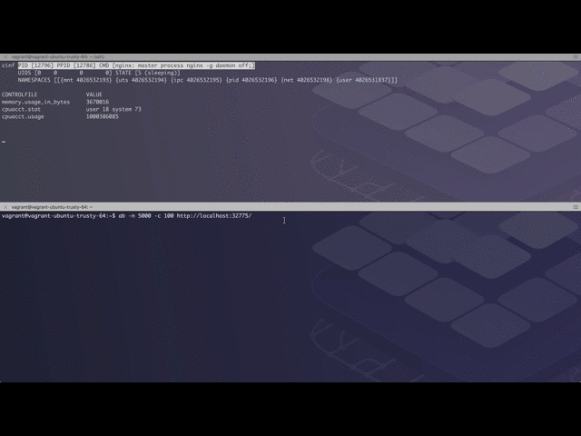

# Walkthrough

In the following I'm walking you through an example session with `cinf`.

## Environment and setup

I've used the following setup:

    $ cat /etc/*-release
    DISTRIB_ID=Ubuntu
    DISTRIB_RELEASE=14.04
    DISTRIB_CODENAME=trusty
    DISTRIB_DESCRIPTION="Ubuntu 14.04.2 LTS"
    NAME="Ubuntu"
    VERSION="14.04.2 LTS, Trusty Tahr"
    ID=ubuntu
    ID_LIKE=debian
    PRETTY_NAME="Ubuntu 14.04.2 LTS"
    VERSION_ID="14.04"
    HOME_URL="http://www.ubuntu.com/"
    SUPPORT_URL="http://help.ubuntu.com/"
    BUG_REPORT_URL="http://bugs.launchpad.net/ubuntu/"
    
    $ sudo docker --version
    Docker version 1.12.2, build bb80604

First, I launch three long-running, daemonized containers with certain limitations set:

    # an NGINX webserver with a CPU share of 25% (relative weight, with 1024 being 100%):
    $ sudo docker run --cpu-shares 256 -d -P nginx
    
    # md5sum with a RAM limit of 10MB:
    $ sudo docker run --memory 10M -d busybox md5sum /dev/urandom
    
    # a sleep process running under UID 1000:
    $ sudo docker run --user=1000 -d busybox sleep 10000

This results in the following Docker containers running:

    $ sudo docker ps
    CONTAINER ID        IMAGE               COMMAND                  CREATED             STATUS              PORTS                                           NAMES
    0c826b914749        busybox             "sleep 10000"            5 seconds ago       Up 4 seconds                                                        peaceful_fermat
    df22714ea743        busybox             "md5sum /dev/urandom"    14 seconds ago      Up 13 seconds                                                       big_rosalind
    9328a856fc31        nginx               "nginx -g 'daemon off"   4 minutes ago       Up 4 minutes        0.0.0.0:32771->80/tcp, 0.0.0.0:32770->443/tcp   zen_keller

As well as the Linux process listing (note: edited down to the important bits)

    $ ps faux
    USER       PID %CPU %MEM    VSZ   RSS TTY      STAT START   TIME COMMAND
    root         1  0.0  0.2  33604  3000 ?        Ss   Oct21   0:00 /sbin/init
    ...
    root       908  0.0  3.2 733452 33372 ?        Ssl  Oct21   2:08 /usr/bin/dockerd --raw-logs
    root      1044  0.0  1.1 300156 11740 ?        Ssl  Oct21   0:27  \_ docker-containerd -l unix:///var/run/docker/libcontainerd/docker-containerd.sock --shim docker-containerd-shi
    root     27672  0.0  0.3 199036  3988 ?        Sl   12:18   0:00  |   \_ docker-containerd-shim 9328a856fc314271f1da1f27345d4c29ae24026a2667172f18084cf5c220ef6f /var/run/docker/l
    root     27681  0.0  0.2  31752  2884 ?        Ss   12:18   0:00  |   |   \_ nginx: master process nginx -g daemon off;
    sshd     27705  0.0  0.1  32144  1664 ?        S    12:18   0:00  |   |       \_ nginx: worker process
    root     27761  0.0  0.3 199036  3984 ?        Sl   12:22   0:00  |   \_ docker-containerd-shim df22714ea7431b32558bc0ae87d2fd4a4a64a2c0bc111e6e85e05de1f6d74006 /var/run/docker/l
    root     27772 98.7  0.0   1172     4 ?        Rs   12:22   1:11  |   |   \_ md5sum /dev/urandom
    root     27849  0.0  0.3 199036  3988 ?        Sl   12:23   0:00  |   \_ docker-containerd-shim 0c826b914749775a9bbb647e80b53f21efdd8d65d5cd665dfd9fa4a211f5a45e /var/run/docker/l
    vagrant  27861  0.0  0.0   1164     4 ?        Ss   12:23   0:00  |       \_ sleep 10000

Above you can see the three containers running with PIDs `27681` (NGINX), `27772` (md5sum), and `27861` (sleep). 

## Usage

Now, since we have everything in place, we can start exploring the namespaces and cgroups in the system:

    $ sudo cinf
    
    NAMESPACE   TYPE  NPROCS  USERS                     CMD
    
    4026532396  pid   1       1000                      sleep10000
    4026532398  net   1       1000                      sleep10000
    4026531837  user  109     0,1,101,102,104,106,1000  /sbin/init
    4026532196  pid   2       0,104                     nginx: master proces
    4026532293  mnt   1       0                         md5sum/dev/urandom
    4026532298  net   1       0                         md5sum/dev/urandom
    4026532393  mnt   1       1000                      sleep10000
    4026532296  pid   1       0                         md5sum/dev/urandom
    4026531840  mnt   104     0,1,101,102,106,1000      /sbin/init
    4026531839  ipc   105     0,1,101,102,106,1000      /sbin/init
    4026531836  pid   105     0,1,101,102,106,1000      /sbin/init
    4026532193  mnt   2       0,104                     nginx: master proces
    4026532198  net   2       0,104                     nginx: master proces
    4026531838  uts   105     0,1,101,102,106,1000      /sbin/init
    4026532194  uts   2       0,104                     nginx: master proces
    4026532294  uts   1       0                         md5sum/dev/urandom
    4026532394  uts   1       1000                      sleep10000
    4026532395  ipc   1       1000                      sleep10000
    4026531956  net   105     0,1,101,102,106,1000      /sbin/init
    4026531856  mnt   1       0
    4026532195  ipc   2       0,104                     nginx: master proces
    4026532295  ipc   1       0                         md5sum/dev/urandom

Running `cinf` without any arguments lists all active namespaces, in our case above 22 of them. Note that each of the namespaces is of a certain type, for example, `4026532193` is of type `mnt` and has two processes in it, running under UIDs `0` and `104`respectively.

So let's dig into the namespace `4026532193` to obtain more information about the processes and cgroups in it:

    $ sudo cinf --namespace 4026532193
    
    PID    PPID   NAME   CMD                   NTHREADS  CGROUPS                                                                                   STATE
    
    27681  27672  nginx  nginx: master proces  1         11:name=systemd:/docker/9328a856fc314271f1da1f27345d4c29ae24026a2667172f18084cf5c220ef6f  S (sleeping)
                                                         10:hugetlb:/docker/9328a856fc314271f1da1f27345d4c29ae24026a2667172f18084cf5c220ef6f
                                                         9:perf_event:/docker/9328a856fc314271f1da1f27345d4c29ae24026a2667172f18084cf5c220ef6f
                                                         8:blkio:/docker/9328a856fc314271f1da1f27345d4c29ae24026a2667172f18084cf5c220ef6f
                                                         7:freezer:/docker/9328a856fc314271f1da1f27345d4c29ae24026a2667172f18084cf5c220ef6f
                                                         6:devices:/docker/9328a856fc314271f1da1f27345d4c29ae24026a2667172f18084cf5c220ef6f
                                                         5:memory:/docker/9328a856fc314271f1da1f27345d4c29ae24026a2667172f18084cf5c220ef6f
                                                         4:cpuacct:/docker/9328a856fc314271f1da1f27345d4c29ae24026a2667172f18084cf5c220ef6f
                                                         3:cpu:/docker/9328a856fc314271f1da1f27345d4c29ae24026a2667172f18084cf5c220ef6f
                                                         2:cpuset:/docker/9328a856fc314271f1da1f27345d4c29ae24026a2667172f18084cf5c220ef6f
    27705  27681  nginx  nginx: worker proces  1         11:name=systemd:/docker/9328a856fc314271f1da1f27345d4c29ae24026a2667172f18084cf5c220ef6f  S (sleeping)
                                                         10:hugetlb:/docker/9328a856fc314271f1da1f27345d4c29ae24026a2667172f18084cf5c220ef6f
                                                         9:perf_event:/docker/9328a856fc314271f1da1f27345d4c29ae24026a2667172f18084cf5c220ef6f
                                                         8:blkio:/docker/9328a856fc314271f1da1f27345d4c29ae24026a2667172f18084cf5c220ef6f
                                                         7:freezer:/docker/9328a856fc314271f1da1f27345d4c29ae24026a2667172f18084cf5c220ef6f
                                                         6:devices:/docker/9328a856fc314271f1da1f27345d4c29ae24026a2667172f18084cf5c220ef6f
                                                         5:memory:/docker/9328a856fc314271f1da1f27345d4c29ae24026a2667172f18084cf5c220ef6f
                                                         4:cpuacct:/docker/9328a856fc314271f1da1f27345d4c29ae24026a2667172f18084cf5c220ef6f
                                                         3:cpu:/docker/9328a856fc314271f1da1f27345d4c29ae24026a2667172f18084cf5c220ef6f
                                                         2:cpuset:/docker/9328a856fc314271f1da1f27345d4c29ae24026a2667172f18084cf5c220ef6f

There are two processes in this namespace with PIDs `27681` and `27705` (the former being the parent of the latter). Also, we can see in which cgroups each of the processes is in. For example, the process with PID `27681` is in a cpu cgroup `/sys/fs/cgroup/cpu/docker/9328a856fc314271f1da1f27345d4c29ae24026a2667172f18084cf5c220ef6f`, with `/sys/fs/cgroup/` being the implicit mount point. We can also see the command line of the process and the number of threads.

Let's now say we're interested in details about said cpu cgroup of the process with PID `27681`. The first entry in the `CGROUPS` column from above is an integer value, in case of the cpu cgroup it's `3` on my system. This integer value is called the cgroup hierarchy ID and you can learn about the available (and enabled) cgroups as well as the mapping via `/proc/cgroups`. 

Now, let's check if the CPU shares we've set are actually in place:

    $ sudo cinf --cgroup 27681:3
    
     CONTROLFILE            VALUE
     
     cpu.shares             256
     cpu.stat               nr_periods 0 nr_throttled 0
                            throttled_time 0
     notify_on_release      0
     tasks                  27681 27705
     cgroup.clone_children  0
     cgroup.procs           27681 27705
     cpu.cfs_period_us      100000
     cpu.cfs_quota_us       -1

Above you can see that in fact there exists a control file `cpu.shares` with the value `256`, exactly what we've asked for.

Similarly, we can verify if the memory limit we've set for the md5sum container (`--memory 10M`, see above) is indeed in place:

    $ sudo cinf --cgroup 27772:5 | grep memory.limit_in_bytes
     memory.limit_in_bytes               10485760
     
And indeed, we can see that the limit we asked for is indeed in place: `memory.limit_in_bytes` is `10485760` Bytes or 10MB.

Let's move on to an interactive mode `cinf` supports, called monitoring mode. It's somehow like `top` and it is triggered by using `--mon` as an argument with the process ID and a column specification as values. So, the format is:

    PID:CF1,CF2,…

With `PID` being the process ID of the process that you want to monitor and `CFx` the name of a cgroups control files as described in the [docs]( http://man7.org/linux/man-pages/man7/cgroups.7.html). Note that if a control file doesn't exist or is mistyped it is simply ignored.

OK, let's monitor NGINX: from above we remember that the PID was `27681` and we want to see memory, CPU and I/O usage, so I'm picking a couple of control files I want to monitor. But before we do that, let's create some load (in a different terminal):

    $ while [ true ] ; do  curl localhost:32771 ; sleep .001 ; done

Now, let's see what `cinf` tells us about the NGINX container resource usage:

    $ sudo cinf --mon 27681:memory.usage_in_bytes,cpu.shares,cpuacct.stat,blkio.throttle.io_serviced,blkio.throttle.io_service_bytes
    cinf PID [27681] PPID [27672] CMD [nginx: master process nginx -g daemon off;]
         UIDS [0	0	0	0] STATE [S (sleeping)]
         NAMESPACES [[{mnt 4026532193} {uts 4026532194} {ipc 4026532195} {pid 4026532196} {net 4026532198} {user 4026531837}]]
    
    CONTROLFILE                         VALUE
    memory.usage_in_bytes               8769536
    cpu.shares                          256
    cpuacct.stat                        user 14 system 18
    blkio.throttle.io_serviced          252:1 Read 483 252:1 Write 0 252:1 Sync 0 252:1 Async 483 252:1 Total 483 Total 483
    blkio.throttle.io_service_bytes     252:1 Read 7282688 252:1 Write 0 252:1 Sync 0 252:1 Async 7282688 252:1 Total 7282688 Total 7282688

The screen is updated every second and you should see `cpuacct.stat` changing, above.

Let's do some monitoring on the md5sum container (that's the one with the memory limit):

    $ sudo cinf --mon 27772:memory.limit_in_bytes,memory.max_usage_in_bytes,memory.usage_in_bytes,cpuacct.stat
    cinf PID [27772] PPID [27761] CMD [md5sum/dev/urandom]
         UIDS [0	0	0	0] STATE [R (running)]
         NAMESPACES [[{mnt 4026532293} {uts 4026532294} {ipc 4026532295} {pid 4026532296} {net 4026532298} {user 4026531837}]]
    
    CONTROLFILE                   VALUE
    memory.limit_in_bytes         10485760
    memory.max_usage_in_bytes     1572864
    memory.usage_in_bytes         1138688
    cpuacct.stat                  user 8655 system 266313

And last but not least, let's see what the sleep container is up to:

    $ sudo cinf/cinf --mon 27861:memory.usage_in_bytes,cpuacct.stat
    cinf PID [27861] PPID [27849] CMD [sleep10000]
         UIDS [1000	1000	1000	1000] STATE [S (sleeping)]
         NAMESPACES [[{mnt 4026532393} {uts 4026532394} {ipc 4026532395} {pid 4026532396} {net 4026532398} {user 4026531837}]]
    
    CONTROLFILE               VALUE
    memory.usage_in_bytes     774144
    cpuacct.stat              user 0 system 0

As expected, `cpuacct.stat` shows no activity.

To finish up, let's do a load test on a new NGINX container with following settings:

    # limit both CPU and memory:
    $ sudo docker run --cpu-quota 5000 --memory 3.5M -d -P nginx
    
    # launch AB load tester:
    $ ab -n 5000 -c 100 http://localhost:32775/
    
    # launch cinf in monitoring mode
    $ sudo cinf --mon 12796:memory.usage_in_bytes,cpuacct.stat,cpuacct.usage

Above would result in something like:

